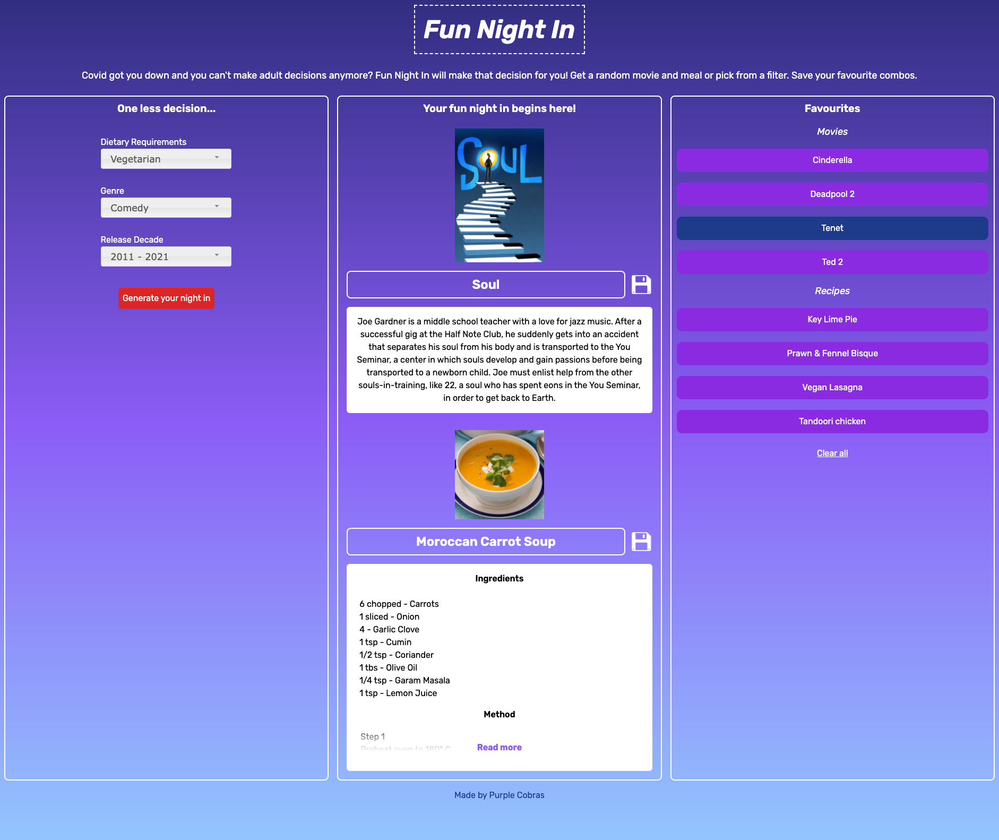
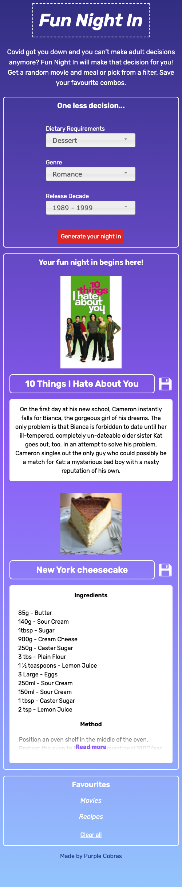

# Fun Night In

> Random movie and meal generator. Includes filters to specify diet requirements, genre and movie release date. Save chosen or favourite results to compare or refer back to later.
> Live demo [_here_](https://adrian-szonyi.github.io/FunNightIn/).

## Table of Contents

- [General Info](#general-information)
- [Technologies Used](#technologies-used)
- [Features](#features)
- [Screenshots](#screenshots)
- [Setup](#setup)
- [Project Status](#project-status)
- [Room for Improvement](#room-for-improvement)
- [Acknowledgements](#acknowledgements)
- [Contact](#contact)

## General Information

Many people are spending more time indoors due to COVID-19 restrictions and the days can become monotomous. Fun Night In movie and meal generator can help to shake things up a bit by offering variety with a random film to watch or meal to create. It can also help if you are indecisive and need some direction. Fun Night In pulls from a database of over 200 meals possibilities and thousands of popular films.

## Technologies Used

- HTML5
- CSS3
- Javascript
- Jquery
- Jquery UI
- tailwindCSS v2.2.15

## Features

- Generate random movie and meal
- Save favourites to compare and for future reference

## Screenshots

## Setup

Download from repository.

## Project Status

Project is: _in progress_

## Room for Improvement

- Ability to remove one favourite from the list at a time. Currently, only all saved items can be deleted.
- Option show more info on the films selected.
- More filters for types of films and dietary requirements.

## Acknowledgements

- The Movie DB [API](https://www.themoviedb.org/documentation/api).
- The Meal DB [API](https://www.themealdb.com/api.php).

## Contact

Created by [@purplecobras](https://github.com/Adrian-szonyi/FunNightIn).
